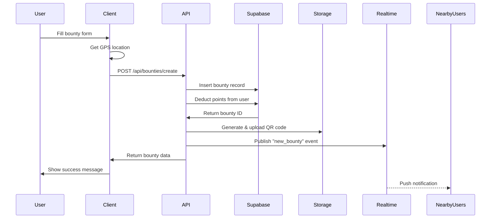
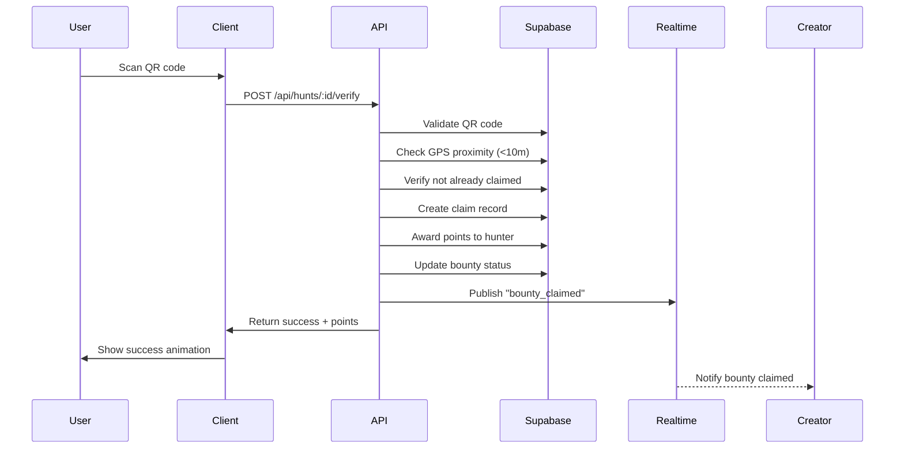

# Bounty Bear - Technical Architecture

## Technology Stack

### Frontend
- **Framework**: React 18 + TypeScript
- **Build Tool**: Vite (fast dev server, optimized builds)
- **Styling**: Tailwind CSS 4 + Custom terminal CSS
- **Maps**: Mapbox GL JS (free tier: 50K loads/month)
- **PWA**: Workbox (offline support, installable)
- **State**: Zustand (lightweight, 1KB)
- **Routing**: React Router v6

### Backend
- **Hosting**: Vercel (serverless functions)
- **Database**: Supabase PostgreSQL + PostGIS
- **Auth**: Supabase Auth (OAuth, email/password)
- **Storage**: Supabase Storage (QR codes, photos)
- **Realtime**: Supabase Realtime (WebSockets)
- **Edge Functions**: Vercel Edge Functions (geolocation API)

### Third-Party Services
- **QR Codes**: qrcode.js (generate client-side)
- **Image Processing**: Sharp (photo verification)
- **Push Notifications**: Web Push API + Supabase triggers
- **Analytics**: Vercel Analytics (built-in)
- **Error Tracking**: Sentry (free tier: 5K events/month)

## System Architecture

```
┌─────────────────────────────────────────────────────┐
│                   CLIENT (PWA)                      │
│  ┌──────────┐  ┌──────────┐  ┌──────────┐         │
│  │   Map    │  │ Terminal │  │  Camera  │         │
│  │ (Mapbox) │  │   UI     │  │ (QR/Photo)│         │
│  └──────────┘  └──────────┘  └──────────┘         │
│         │              │              │             │
│         └──────────────┴──────────────┘             │
│                       │                              │
└───────────────────────┼──────────────────────────────┘
                        │ HTTPS/WSS
┌───────────────────────┼──────────────────────────────┐
│               VERCEL SERVERLESS                       │
│  ┌────────────┐  ┌────────────┐  ┌────────────┐    │
│  │ /api/      │  │ /api/      │  │ /api/      │    │
│  │ bounties   │  │ hunts      │  │ verify     │    │
│  └────────────┘  └────────────┘  └────────────┘    │
│         │              │              │              │
└─────────┼──────────────┼──────────────┼──────────────┘
          │              │              │
┌─────────┼──────────────┼──────────────┼──────────────┐
│         ▼              ▼              ▼               │
│              SUPABASE PLATFORM                        │
│  ┌──────────────────────────────────────────┐       │
│  │  PostgreSQL + PostGIS (Geo Queries)      │       │
│  │  ┌────────┐ ┌────────┐ ┌────────┐       │       │
│  │  │bounties│ │ hunts  │ │ users  │       │       │
│  │  └────────┘ └────────┘ └────────┘       │       │
│  └──────────────────────────────────────────┘       │
│  ┌──────────────────────────────────────────┐       │
│  │  Realtime (WebSockets for live updates)  │       │
│  └──────────────────────────────────────────┘       │
│  ┌──────────────────────────────────────────┐       │
│  │  Storage (QR codes, verification photos) │       │
│  └──────────────────────────────────────────┘       │
│  ┌──────────────────────────────────────────┐       │
│  │  Auth (JWT tokens, session management)   │       │
│  └──────────────────────────────────────────┘       │
└───────────────────────────────────────────────────────┘
```

## Database Schema

See [DATABASE.md](./DATABASE.md) for complete schema with indexes and queries.

**Core Tables:**
- `users` - Player profiles, points, reputation
- `bounties` - Location, clues, rewards, status
- `hunts` - Active/completed hunts, progress tracking
- `claims` - Verification records, timestamps
- `leaderboards` - Cached rankings (updated hourly)

## API Endpoints

See [API.md](./API.md) for complete API documentation.

### Bounty Management
```
POST   /api/bounties/create       - Create new bounty
GET    /api/bounties/nearby       - Get bounties within radius
GET    /api/bounties/:id          - Get bounty details
DELETE /api/bounties/:id          - Cancel bounty (creator only)
```

### Hunt Management
```
POST   /api/hunts/start           - Accept bounty hunt
GET    /api/hunts/active          - Get user's active hunts
POST   /api/hunts/:id/unlock-clue - Unlock clue by proximity
POST   /api/hunts/:id/verify      - Submit verification (QR/photo)
```

### User & Social
```
GET    /api/users/profile         - Get user profile
PATCH  /api/users/profile         - Update profile
GET    /api/leaderboard           - Get top 100 players
GET    /api/activity-feed         - Recent claims in area
```

## Data Flow Examples

### Creating a Bounty



### Claiming a Bounty



## Security Considerations

### Authentication
- JWT tokens with 7-day expiration
- Refresh tokens for seamless re-auth
- OAuth providers: Google, Apple, GitHub
- Rate limiting: 100 requests/minute per user

### Authorization
- Row-level security (RLS) policies in Supabase
- Users can only modify their own bounties/hunts
- Admin role for moderation (ban users, remove bounties)

### GPS Validation
```typescript
// Server-side proximity check
function isWithinClaimRadius(
  userLat: number,
  userLng: number,
  bountyLat: number,
  bountyLng: number
): boolean {
  const distance = calculateHaversineDistance(
    userLat, userLng, bountyLat, bountyLng
  );
  return distance <= 10; // 10 meters
}

// Anti-spoofing: velocity check
function isValidMovement(
  prevLocation: Location,
  currentLocation: Location,
  timeDelta: number
): boolean {
  const distance = calculateHaversineDistance(
    prevLocation.lat, prevLocation.lng,
    currentLocation.lat, currentLocation.lng
  );
  const speed = distance / timeDelta; // meters per second
  return speed < 100; // Max 100 m/s (~360 km/h)
}
```

### QR Code Security
- Unique UUID per bounty
- Signed with HMAC to prevent forgery
- Time-limited: Expire after 7 days
- One-time use: Marked as claimed after verification

```typescript
// QR code format
const qrData = {
  bountyId: "uuid-v4",
  signature: hmacSha256(bountyId + secretKey),
  expiresAt: Date.now() + 7 * 24 * 60 * 60 * 1000
};
```

### Photo Verification
- Image uploaded to Supabase Storage (private bucket)
- ML-based image similarity check (future: TensorFlow.js)
- Manual review queue for flagged claims
- EXIF data validation (GPS coordinates, timestamp)

## Performance Optimization

### Caching Strategy
- **Static Assets**: CDN cache (Vercel Edge Network)
- **Map Tiles**: Mapbox cache (automatic)
- **Leaderboards**: Redis cache, 5-minute TTL
- **User Profiles**: Client-side cache (Zustand persist)

### Database Indexes
```sql
-- Geospatial index for nearby bounty queries
CREATE INDEX bounties_location_idx ON bounties USING GIST (location);

-- Composite index for leaderboard queries
CREATE INDEX users_points_created_idx ON users (points DESC, created_at DESC);

-- Index for active hunt lookups
CREATE INDEX hunts_user_status_idx ON hunts (user_id, status) WHERE status = 'active';
```

### Lazy Loading
- Map markers load in chunks (50 at a time)
- Infinite scroll for activity feed
- Image optimization: WebP format, 800px max width
- Code splitting: Route-based chunks (Vite automatic)

## Monitoring & Observability

### Metrics (Vercel Analytics)
- Page load times (P50, P95, P99)
- API response times
- Error rates by endpoint
- Real user monitoring (RUM)

### Logging (Supabase)
- Database slow query log (>100ms)
- Failed authentication attempts
- Suspicious GPS patterns (flagged claims)
- WebSocket connection errors

### Alerts (Sentry)
- Critical errors → Slack notification
- High error rate (>1% of requests)
- Database connection failures
- Payment processing errors (future)

## Scalability Considerations

### Current Limits (Free Tier)
- Supabase: 500MB database, 1GB storage
- Vercel: 100GB bandwidth, 100 serverless invocations/day
- Mapbox: 50K map loads/month

### Scaling Strategy
**10K Users:**
- Stay on free tier
- Optimize queries with indexes
- Cache leaderboards aggressively

**100K Users:**
- Upgrade Supabase to Pro ($25/month): 8GB database
- Upgrade Vercel to Pro ($20/month): 1TB bandwidth
- Add Redis for caching (Upstash free tier: 10K commands/day)

**1M Users:**
- Supabase Team plan ($599/month): 100GB database
- Vercel Enterprise: Custom pricing
- CDN for map tiles: Cloudflare R2
- Horizontal scaling: Read replicas for leaderboards

## Development Environment

### Local Setup
```bash
# 1. Clone repo
git clone https://github.com/yourusername/bounty-bear.git
cd bounty-bear

# 2. Install dependencies
npm install

# 3. Set up environment variables
cp .env.example .env.local
# Add Supabase URL, Anon Key, Mapbox token

# 4. Run Supabase locally (Docker)
npx supabase start

# 5. Apply migrations
npx supabase db push

# 6. Start dev server
npm run dev
```

### Testing Strategy
- **Unit Tests**: Vitest (utility functions, calculations)
- **Integration Tests**: Playwright (API endpoints)
- **E2E Tests**: Playwright (user flows)
- **Load Tests**: k6 (1000 concurrent users)

### CI/CD Pipeline
```yaml
# .github/workflows/deploy.yml
name: Deploy
on:
  push:
    branches: [main]
jobs:
  test:
    - Run linter (ESLint)
    - Run type check (tsc)
    - Run unit tests (Vitest)
    - Run E2E tests (Playwright)
  deploy:
    - Deploy to Vercel (production)
    - Run database migrations
    - Invalidate CDN cache
```

## Cost Breakdown (MVP)

### Free Tier
- Vercel Hobby: $0
- Supabase Free: $0
- Mapbox Free: $0 (up to 50K loads)
- Sentry Free: $0 (5K events)
**Total: $0/month**

### Paid Tier (100K users)
- Vercel Pro: $20/month
- Supabase Pro: $25/month
- Mapbox Pay-As-You-Go: ~$50/month (200K loads)
- Sentry Team: $26/month (50K events)
**Total: $121/month**

### Revenue Projection
- 100K users × 5% conversion = 5,000 premium
- 5,000 × $4.99 = $24,950/month
- Minus costs: $24,950 - $121 = **$24,829/month profit**

---

**Next Steps:** See [DATABASE.md](./DATABASE.md) for complete schema design.
